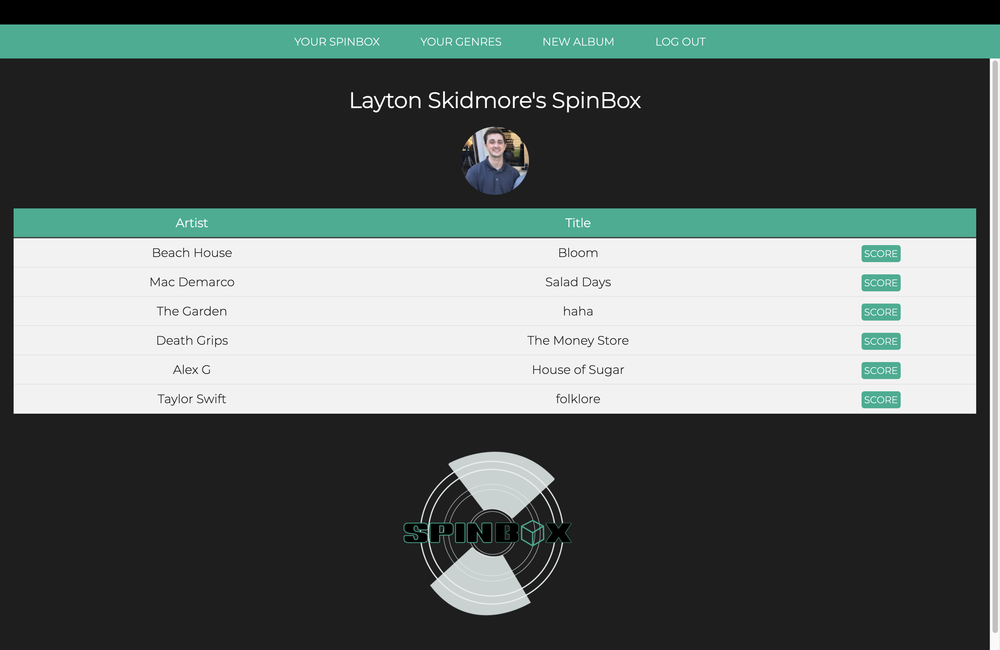
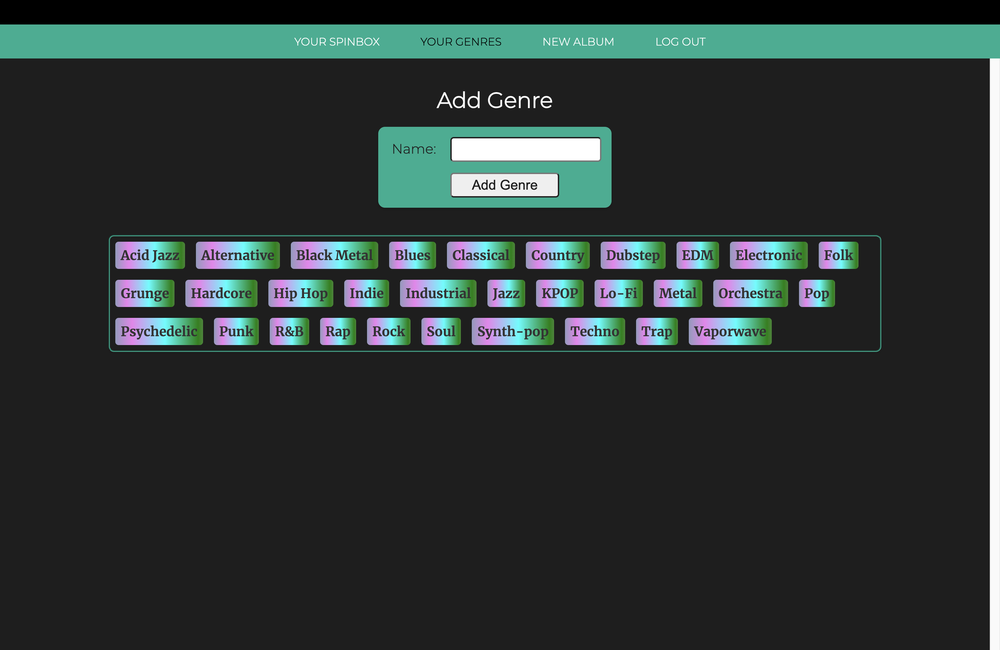
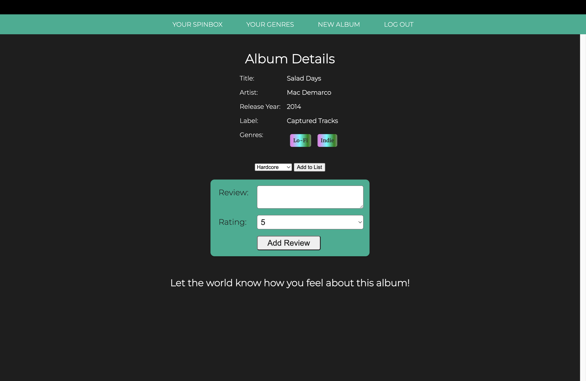

# SpinBox

()

SpinBox is an app that caters to music enthusiasts, where users can curate album collections, share reviews, and provide scores for their favorite music. This platform allows subjective album genre classifications, filling the void in the market for a dedicated music review app comparable to Letterboxd or Goodreads. SpinBox aims to foster a vibrant community of music lovers, encouraging exploration and discussions about the artistry and impact of diverse musical works.

## Screenshots

## Technologies Used
- CSS
- JavaScript
- EJS
- MongoDB
- Mongoose
- Express
- Node
- Google and Spotify's API

## Icebox Features
- Album Artwork
- Personal profiles
- Friend's List
- Spotify Web Player

## Live Link

https://vast-meadow-90760-c21927800c06.herokuapp.com/

